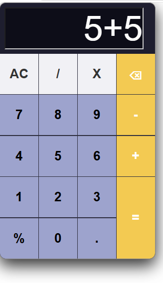

# 🧮 Calculator

A simple functional, interactive web calculator built using pure HTML, CSS and inline JavaScript.

## 👁️ Preview

## 💡 Features & Functionality

- **Dynamic Display:** Uses string concatenation to append input values directly to the display field.
- **Clear (`AC`):** Resets the display variable to an empty string.
- **Delete (`⌫`):** Uses JavaScript's `.slice(0,-1)` method to remove the last entered character one by one.
- **Mathematical Operations:** Supports addition, subtraction, multiplication, division and **modulus (`%`)** calculations.

## 🛠️ Tech Stack

- **HTML5:** Semantic markup and structure
- **CSS3:** Custom layout and styling
- **JavaScript (Inline):** DOM manipulation via `document.querySelector('#display')` to handle click events and update input values in real time

 